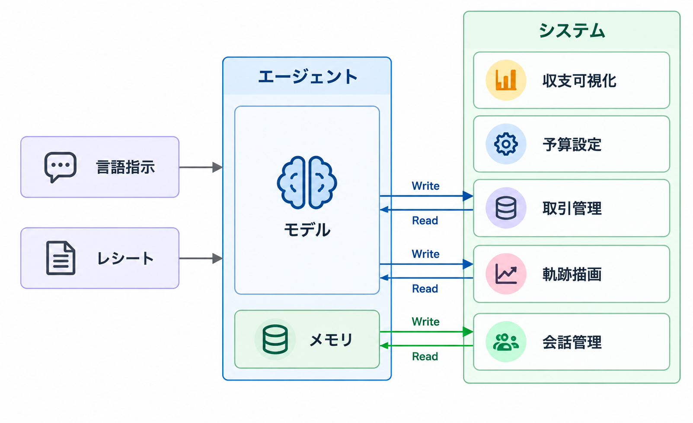

# Kakei


## 要約

Kakeiは、家計簿・訪問の記録・AIチャットをまとめたアプリです。毎月の収入と支出、カテゴリ別の内訳、予算の残りをひと目で確認。「何にいくら使ったか」に加えて、「いつ、どこで使ったか」も地図と時系列で振り返れます。

レシートの画像やPDFを添付すれば、AIが内容を読み取り、取引の登録をサポート。チャットで記録の追加や修正を依頼でき、取引の変更は内容を確認してから保存できます。


## インストール

Kakeiは、自分のパソコンで起動し、ブラウザから利用するアプリです。

### 1. 必要なツールを準備する

以下をインストールしてください。

- Git
- uv（Python環境管理ツール）

Python 3.14は、必要に応じてuvが自動で取得します。通常の利用にはNode.jsは不要です。

### 2. アプリをダウンロードする

ターミナルで次のコマンドを実行します。

```
git clone https://github.com/KabuxX/Kakei.git
cd Kakei
```

### 3. 依存パッケージをインストールする

```
uv sync --project backend --locked
```

### 4. アプリを起動する

```
uv run --project backend --locked fastapi run backend/server.py --host 127.0.0.1 --port 8765
```

起動後、ブラウザで `http://localhost:8765/` を開いてください。

利用中はターミナルを開いたままにします。終了するときは `Ctrl + C` を押してください。次回以降は、`Kakei` フォルダで同じ起動コマンドを実行します。

### AIチャット・レシート読み取りを使う場合

`.env.example`ファイルによって`.env` ファイルを作成します。

```
cp .env.example .env
```

`.env` ファイルに**OPENAI API KEY**と**OPENAIモデル名**を記入してください。値は自分のAPIキーと利用するモデル名に置き換えます。

```
OPENAI_API_KEY=your_openai_api_key
KAKEI_AGENT_MODEL=your_model_name
```

レシート読み取りには、画像・PDF入力と構造化出力に対応したモデルを指定してください。設定後にアプリを再起動すると、Agent Chatを利用できます。

これらの設定がなくても、家計簿・予算管理・保存済みの記録の閲覧は利用できます。

### 店舗検索・地図表示を使う場合

Google Cloudで**Places API (New)**と**Maps JavaScript API**を有効にし、課金を設定します。`.env` に次の設定を追加してください。

```
GOOGLE_PLACES_API_KEY=your_google_places_api_key
GOOGLE_MAPS_BROWSER_API_KEY=your_google_maps_browser_api_key
```

- `GOOGLE_PLACES_API_KEY`：店舗検索用。API制限をPlaces API (New)に設定します。
- `GOOGLE_MAPS_BROWSER_API_KEY`：地図表示用。別のキーを作成し、API制限をMaps JavaScript API、HTTPリファラー制限を `http://localhost:8765/*` に設定します。

OpenAI・GoogleのAPI利用には、それぞれのサービスの利用料金が発生します。

### データの保存先

取引・予算・軌跡・レシートなどは、次のSQLiteファイルに保存されます。

```
backend/data/kakei.sqlite3
```

バックアップする場合は、アプリを停止してからこのファイルをコピーしてください。Kakeiはローカル利用向けのアプリです


## アプリフレームワーク


